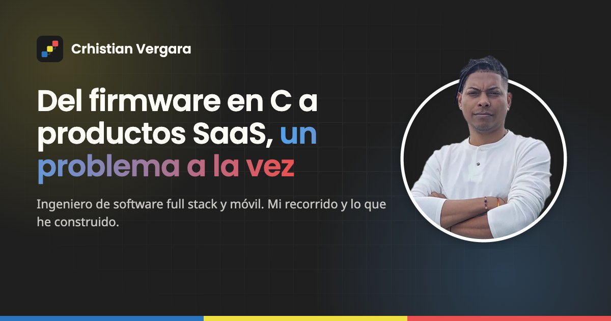

# Hola, soy Crhistian Vergara

Ingeniero de software full stack y móvil en Palmira, Colombia. Mi experiencia no es un stack fijo: en más de diez años cada proyecto me llevó a una capa nueva, y aprender lo que esa capa pedía se volvió parte del trabajo.

[Portfolio](https://krisskira.github.io/krisskira/) · [LinkedIn](https://www.linkedin.com/in/cristian-david-vergara-gomez/) · [Correo](mailto:krisskira@gmail.com) · [Read in English](README.md)

## Cómo llegué aquí

- **2016–2019 · Del sensor a la pantalla.** Empecé programando microcontroladores PIC en C y construyendo Kriver SmartHome, un proyecto de domótica que se controlaba desde el navegador. Eso me obligó a hacer también la parte web: PHP, JavaScript y, con el tiempo, mi propio framework MVC.
- **2019–2023 · Móvil y, después, arquitectura.** El móvil pasó a ser el trabajo diario: apps de fintech y comercio electrónico en React Native. Al crecer, aprendí Clean Architecture y DDD para que el equipo pudiera seguir construyendo encima, y llevé esas ideas a proyectos con TypeScript, React/Cypress y Django/Docker.
- **2023–2024 · El aporte está donde está el problema.** Un mismo periodo pidió React Native, iOS nativo y un backend en Python con FastAPI. Refactorizar las consultas a MongoDB redujo los tiempos de respuesta, y SwiftUI con MVVM, Combine y MapKit me permitió colaborar tanto en lo nativo como en lo multiplataforma.
- **2024–2025 · Infraestructura y coordinación.** Después de explorar AWS Cognito con Next.js, el trabajo pasó a React y a AWS Lambda con SAM. Construí una plantilla frontend para proyectos nuevos y coordiné el frontend para que el equipo pudiera entregar.
- **2025–2026 · Varios productos, el mismo modo de aportar.** Colaboré en frontend y backend de distintos productos SaaS y bases relacionales: leía sistemas que no había diseñado, aprendía cada dominio y aplicaba lo que ya sabía. También incorporé la IA al flujo de trabajo.
- **2026 · De vuelta al hardware.** Con todo eso acumulado volví al punto de partida: firmware, PCB, carcasa impresa en 3D y una app de escritorio en un mismo proyecto.

## Lo que me enseñó

- A ver un sistema de punta a punta, del firmware a la interfaz y los datos.
- A estructurar el código para que sobreviva al cambio, sin importar el lenguaje.
- A leer sistemas que no diseñé y aportar dentro de sus reglas.
- A trabajar con límites duros: mi último firmware ocupa 16 382 de 16 384 bytes de flash.

## Lo que construyo

- **[HotPlate](https://github.com/krisskira/smd-soldering-hotplate)**: estación de reflow SMD con control PI, pantalla propia y app de escritorio. *C · ATmega16 · KiCad · Python*
- **kLog** *(en desarrollo)*: logs y eventos self-hosted para aplicaciones y dispositivos. *Go · GraphQL · PostgreSQL · Redis*
- **[GIF → ST7920](https://github.com/krisskira/st7920-image-gif-to-bytes)**: convierte GIF en arreglos C para pantallas de 128×64 en microcontroladores con poca memoria. *Python*
- **[Calculadora de dígitos manuscritos](https://github.com/krisskira/ml-handwritten-number-recognizar)**: mi entrada al aprendizaje automático. *Python · Keras*

## Explora

La historia completa, etapa por etapa, está en mi **[portfolio](https://krisskira.github.io/krisskira/)**. El código, en mis [repositorios](https://github.com/krisskira?tab=repositories).
