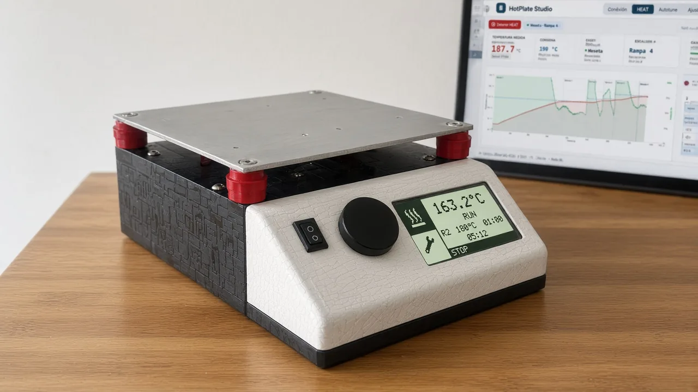

# Hi, I'm Crhistian Vergara

**From C firmware to SaaS products, one solution at a time.**

For more than ten years I've been building custom web and mobile apps, SaaS platforms, firmware and hardware, and I bring artificial intelligence into your processes to automate repetitive work. Every experience has made me stronger and pushed my career forward, as I picked up new skills and delivered solutions.

[Portfolio](https://krisskira.com/) · [LinkedIn](https://www.linkedin.com/in/cristian-david-vergara-gomez/) · [WhatsApp](https://wa.me/573183919187) · [Email](mailto:krisskira@gmail.com) · [Buy me a coffee](https://paypal.me/KRIVERDEVICE?locale.x=es_XC&country.x=CO) · [Leer en español](README.es.md)

## My career path

- **2016–2019 · From the sensor to the screen.** I started out programming PIC microcontrollers in C and building Kriver SmartHome, an idea for affordable home automation controlled from the browser. In parallel I was building web applications with PHP and JavaScript, and in 2018 I published my own MVC framework.
- **2019–2023 · When the product grows, so does its structure.** For four years I built fintech and e-commerce apps in React Native. I brought in Clean Architecture and DDD so the team could keep building without rewriting the code, and kept practicing with TypeScript, React, Cypress, Django and Docker.
- **2023–2024 · Contributing right where it's needed.** I worked on React Native, a native iOS app and a Python backend with FastAPI. I refactored the MongoDB queries and response times dropped significantly. With SwiftUI, MVVM, Combine and MapKit I contributed on both native and cross-platform work.
- **2024–2025 · Building the groundwork so the team can move forward.** The work moved to React and AWS Lambda with SAM. I built a frontend template for new projects and coordinated the frontend to get the delivery out the door.
- **2025–2026 · Stepping into different systems and moving them forward.** I collaborated on the frontend and backend of several SaaS products at once and brought artificial intelligence into my development workflow. I earned Talento Tech's Artificial Intelligence certification and work with Keras, LangChain, RAG and models such as OpenAI and Llama.
- **2026 · Back to hardware, with everything I've learned.** Today I use everything I've learned in a single product, from electronics and firmware to apps, data and AI.

## Every project taught me something

- **From the idea to the finished product.** I work on firmware, mobile apps, web, backend and cloud, and I understand how every piece of a product fits together.
- **Code that grows with you.** Clean Architecture and DDD in TypeScript, React and Swift so every product can take the next change.
- **AI that automates the work.** AI is part of my daily work and of products like KiCad IA.
- **Joining teams already in motion.** I quickly understand a system I didn't design and contribute within its rules.
- **Building the groundwork for others.** Templates and coordination so the team can deliver. This page comes from a template I maintain.
- **Hardware that really works.** Electronics, firmware and the software that goes with them, always putting safety first.

## What I've built on my own

### [KiCad IA](https://krisskira.github.io/kicad-ia-chat/)

Design your PCB in KiCad faster with artificial intelligence. Describe what you need in a few words and KiCad IA builds the schematic with the parts from your libraries, organizes the board and suggests how to place and route the components.

- **Why it exists.** I got tired of seeing similar solutions that cost too much and still didn't solve what I was looking for. Many never became anything complete or even reasonably usable, and others simply didn't work. So I decided to build a free one, inside a program we all know and love, KiCad.
- **What it does.** It turns a sentence into a schematic with your own symbols and footprints. It asks for what's missing instead of making up parts, and it saves a backup before touching anything. It proposes a placement checked against IPC Class 2 criteria and autoroutes with FreeRouting once you confirm. It works with Gemini, OpenAI or Ollama, and also from Cursor as an MCP server.

[Page](https://krisskira.github.io/kicad-ia-chat/) · [Entry](https://kriverdevice.krisskira.com/proyectos/kicad-ia) · [Code](https://github.com/krisskira/kicad-ia-chat) · [Buy me a coffee](https://paypal.me/KRIVERDEVICE?locale.x=es_XC&country.x=CO)

### [HotPlate](https://krisskira.github.io/smd-soldering-hotplate/)

A free and open soldering station for SMD components. Set up a profile with up to four ramps, press RUN and HotPlate takes care of the rest. Run it from its own display or from HotPlate Studio on your computer.

- **Why it exists.** Soldering SMD with an iron gets tricky the moment a QFN shows up, and a hot plate has inertia. If you cut the heat right when it arrives, it keeps climbing a few degrees. That's why HotPlate looks 15 seconds ahead, eases off the power early and works through every plateau without you watching the thermometer.
- **The challenge.** Taking a low-resource microcontroller I had on hand, the ATmega16, and getting the most out of it. I optimized the firmware to handle the heat, the display and USB at the same time, and complemented it with **HotPlate Studio**, a Python app that extends what the device can do. With it you see the live curve, tune the control and save everything to the device's memory.

[Page](https://krisskira.github.io/smd-soldering-hotplate/) · [Entry](https://kriverdevice.krisskira.com/proyectos/hotplate-smd) · [Code](https://github.com/krisskira/smd-soldering-hotplate) · [Support the project](https://www.paypal.com/donate/?hosted_button_id=SBYR4CK2WEE9Q)

### [kLog](https://klog.krisskira.com/) *(coming soon)*

kLog records every event and tracks what happens in your app. It keeps each team's space separate, follows events per project and helps you find what failed. Search, understand and alert from a single place.

- **What it does.** It takes in events with a simple POST and finds them even if you mistype the search. Before storing them it drops what you don't want and adds tags. If an event matches one of your rules, it notifies another system with signed webhooks. It ships clients for Node, Go, Python, PHP, Java, the browser and ESP32.
- **Everyone sees their own.** Each organization has its own isolated environment and decides who sees what, by application, tag or project.
- **Where it's headed.** Accounts, teams and permissions are taking shape. Fine-tuned search, adjustments on arrival and alerts are being finished.

[Page](https://klog.krisskira.com/) · [Entry](https://kriverdevice.krisskira.com/proyectos/klog) · [Support the build](https://www.paypal.com/donate/?hosted_button_id=P5EZFFPYSZRW4)

### Earlier projects

- **[Kriver SmartHome](https://github.com/krisskira/Kriver-Hardware)**: firmware to control lights and appliances over the home WiFi, with a server acting as the hub. *C · PIC 18F4620 · 2017*
- **[PIC 18F2550 traffic lights](https://github.com/krisskira/Semaforo-Pic-18F-2550)**: a traffic-light model programmed in C with PIC CCS and simulated in Proteus. *C · PIC · 2017*
- **[DDD in TypeScript](https://github.com/krisskira/demo-using-ddd)**: a CRUD with Domain-Driven Design and a React frontend. *TypeScript · React · 2022*
- **[Kriver PHP MVC framework](https://github.com/krisskira/PHP-MVC-Kriver-Framework)**: my own framework with a router, controllers, views and a small ORM. *PHP · 2018*

Found them useful? [Buy me a coffee](https://paypal.me/KRIVERDEVICE?locale.x=es_XC&country.x=CO).

## Explore

The full story, stage by stage, is on my **[portfolio](https://krisskira.com/)**. The code is in my [repositories](https://github.com/krisskira?tab=repositories).

## Let's talk about your next project

Got an idea, a process you want to automate with AI or a product to build? Tell me about it and we'll make it happen, from the app to the hardware.

[Email](mailto:krisskira@gmail.com) · [WhatsApp](https://wa.me/573183919187) · [LinkedIn](https://www.linkedin.com/in/cristian-david-vergara-gomez/) · [Buy me a coffee](https://paypal.me/KRIVERDEVICE?locale.x=es_XC&country.x=CO) · [See my career path](https://krisskira.com/#recorrido)
